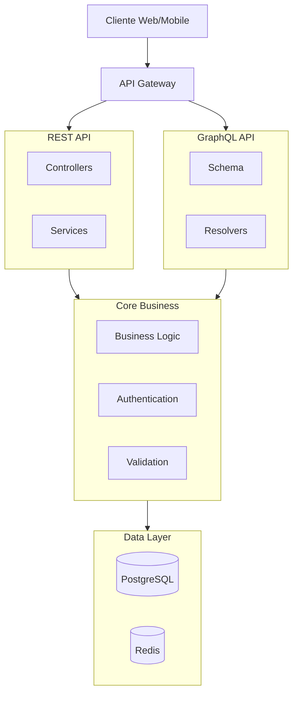
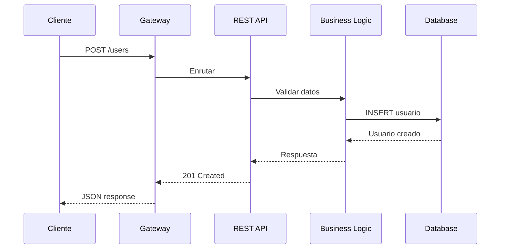
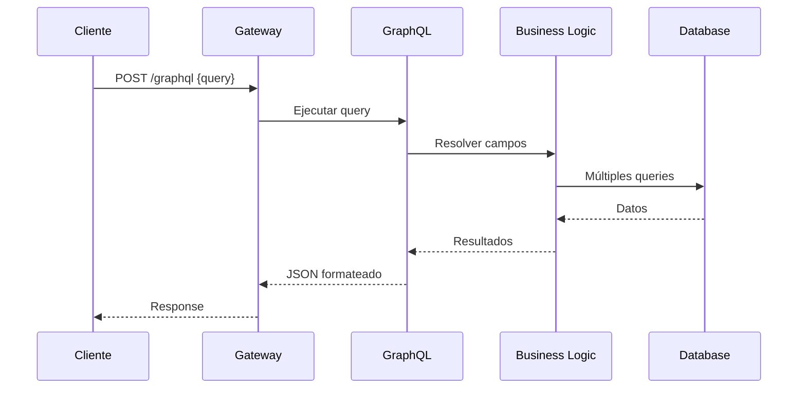
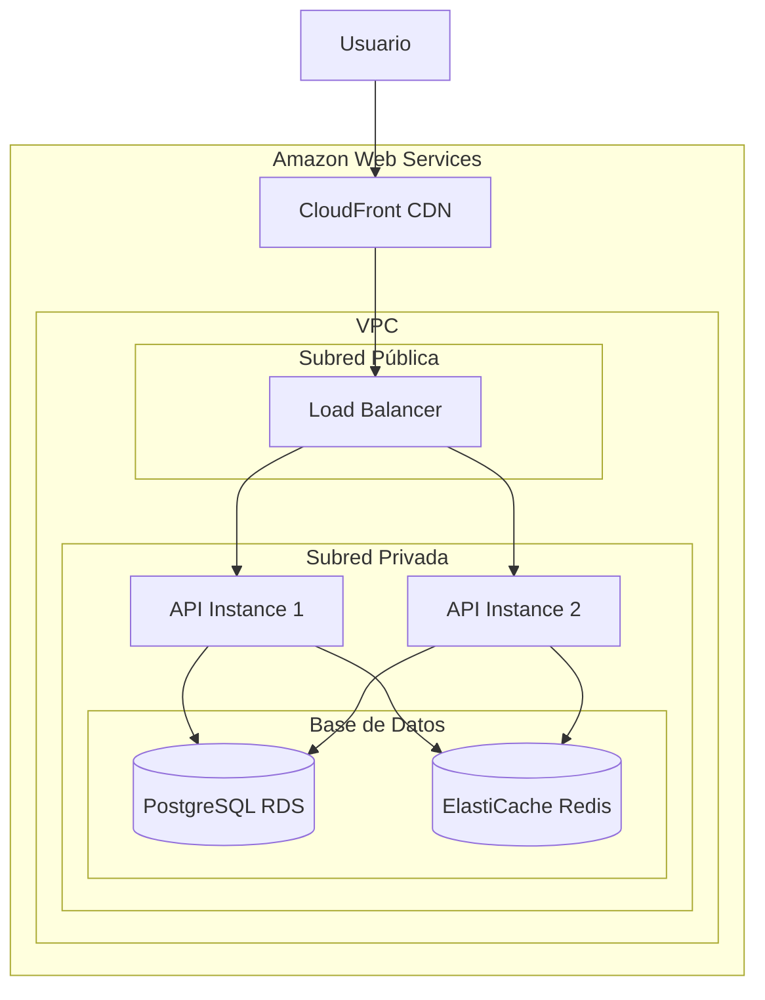

# Diagramas de Arquitectura

## Diagrama de Componentes

## Diagrama de Flujo - REST

## Diagrama de Flujo - GraphQL

## Diagrama de Despliegue

## Componentes Principales

| Componente | Tecnología | Descripción |
|------------|------------|-------------|
| API Gateway | NGINX/AWS | Enrutamiento y rate limiting |
| REST API | Node.js/Express | Endpoints tradicionales |
| GraphQL API | Apollo Server | Consultas flexibles |
| Base de Datos | PostgreSQL | Datos relacionales |
| Caché | Redis | Sesiones y caché |
| CDN | CloudFront | Contenido estático |